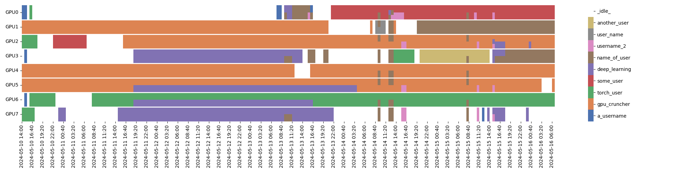

# NVIDIALog

Logger of NVIDIA GPU use, based on nvidia-smi and the wrapper package [nvsmi](https://pypi.org/project/nvsmi/).

## Logging

`nvidialog.py` logs every minute the processes using the GPUs on the system.
The format of each row is:
```text
timestamp, interval_duration_in_secs, gpu_id, gpu_utilization_percent, gpu_used_memory, process_pid, process_owner, command_line
```
e.g.:
```text
1715344059,60,0,100,17936,130204,esuli,NOT_LOGGED
1715344120,60,0,100,17936,130204,esuli,NOT_LOGGED
```

Command line of each process is logged only if enabled using the `--log_cmdline` argument.

If multiple process are running at the same moments, multiple lines will be printed.
If no process is using a GPU, nothing will be printed.
Utilization percentage is relative to the whole GPU, not to the single process using it.

### Arguments
```text
usage: nvidialog.py [-h] [--interval INTERVAL] [--log_cmdline]
                    [--output_file OUTPUT_FILE]

options:
  -h, --help            show this help message and exit
  --interval INTERVAL   Interval log in seconds
  --log_cmdline         Enable command-line logging
  --output_file OUTPUT_FILE
                        Output file, default is standard output
```

## Report

`nvidialog-report.py` prints a markdown-formatted report from the log, and can generate a plot of user/gpu usage over time. See the [example report](example_report.md) and the [example plot](example_plot.pdf).

The plot is generated using matplotlib, the extension of the filename determines the format of the file (e.g., .pdf, .png, .svg).

[](example_plot.png)

Usernames can be mapped to alternative names.
This can be useful to group users by affiliation/work group/project.

### Arguments
```text
usage: nvidialog-report.py [-h] [--num_gpus NUM_GPUS] [--input_file INPUT_FILE] [--output_file OUTPUT_FILE] [--plot_file PLOT_FILE] [--plot_slices PLOT_SLICES] [--user_map USER_MAP] [--sort_by_use] [--last-year | --last-month | --last-week | --last-day | --last-hour | --interval START END]

options:
  -h, --help            show this help message and exit
  --num_gpus NUM_GPUS   Number of GPUs (default: it is inferred from log)
  --input_file INPUT_FILE
                        Input file, (default: standard input)
  --output_file OUTPUT_FILE
                        Output file (default: standard output)
  --plot_file PLOT_FILE
                        Plot user/GPU map to file (default: no plot). The filename extension determines the output format (e.g.: .pdf/.png/.svg)
  --plot_slices PLOT_SLICES
                        Number of time slices in the plot (default: 250)
  --user_map USER_MAP   Mapping of user names to alternative names. One per line, format: "user,newname" (default: no mapping)
  --sort-by-use         Sort table by descending use in the report (default: sort by name)
  --last-year           Process logs from the last year. This and the following options are mutually exclusive (default: process the whole input data)
  --last-month          Process logs from the last month
  --last-week           Process logs from the last week
  --last-day            Process logs from the last day
  --last-hour           Process logs from the last hour
  --interval START END  Process logs within the given start and end date (using ISO 8601 format: 2024-12-26T12:30:00)

```

## Realtime query

`nvidialog-now.py` prints the currently running processes, with memory occupation, username, and the command line:

```text
user@host:~$ nv-now
 GPU  Mem (MB)      PID             User                                                                 Command
   0     18776  1918054         username  python train_3d.py --dataset_name datamodel --network anet3d --path...
   0       868  1999026     another.user  /raid/homes/another.user/miniconda3/envs/text/bin/python -m ipython...
   1     57226   819106         username  python train_3d.py --dataset_name datamodel2 --network bnet3d --pat...
   2      9106  1642497         username  python train_3d.py --dataset_name datamodel2 --network bnet3d --pat...
   3     13828  1944849         username  python train_3d.py --dataset_name datamodel --network anet3d --path...
user@host:~$
```

## License

See [LICENSE](LICENSE)